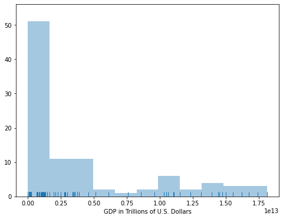
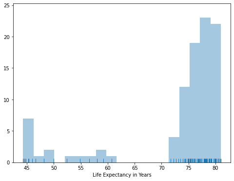

# Life Expectancy-and GDP Analysis

## Questions
---
1. Is there disparity between each country with GDP and Life Expectancy?
2. Is there correlation between GDP and life Expectancy for each country?
3. Has GDP increased for each country?
4. Has life expectancy risen for each country?
5. What's the average life expectancy between these countries?

## Conclusion
---
1. There disparity between each country as shown with these two figure

## Future Research
